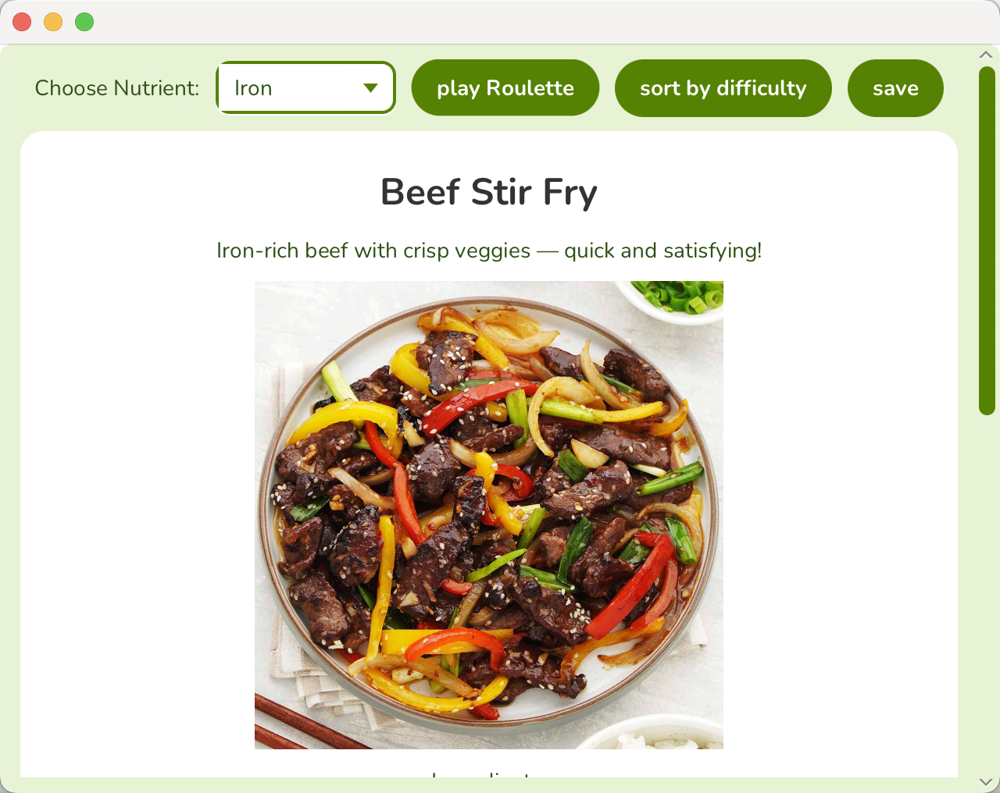

# NutriRoulette: a javafx-based application helps you decide what to eat
### Introduction
NutriRoulette, this recipe application is based on the idea that it can generate recipe
based on the nutrient you need to supplement. It can also help you with "decidophobia",
just click ***play roulette*** button, it can immediately generate a random recipe.
If you are not happy with the result, feel free to play roulette again. It also offers
the option to list all recipes sorted by difficulties, choose whichever function that best suits 
your needs!

### Screen shots

